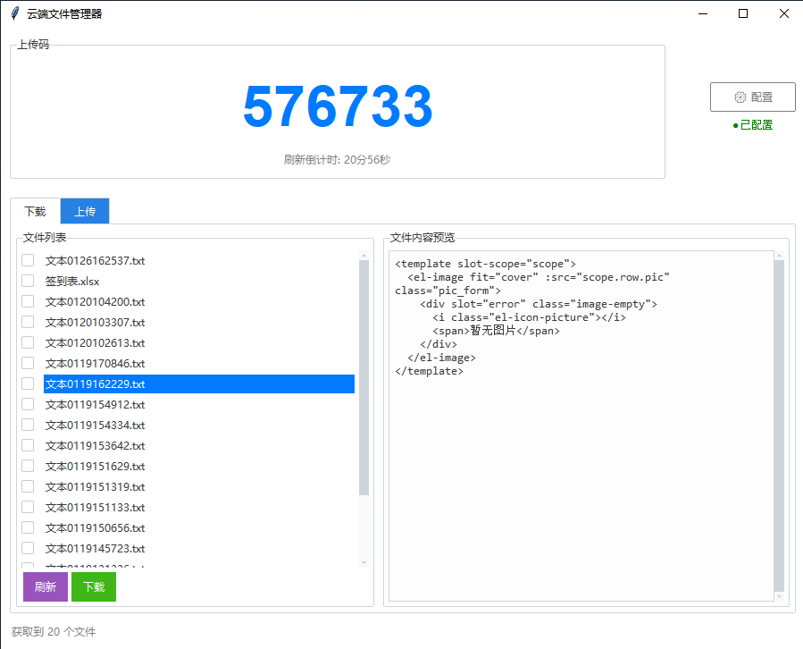

# 税务云端文件管理器



------------------------------------------------------------------------

一个基于 Python + ttkbootstrap 的桌面端 **云端文件管理器**，支持文件上传、下载、文本与二维码上传方式，并提供直观的图形界面与下载管理器。

## ✨ 功能特性

- 🔐 **账号登录**
  - 支持云端服务器账号登录
  - 自动重登机制，登录失效自动恢复

- 📥 **文件下载**
  - 文件列表自动刷新
  - 支持单个 / 多选下载
  - 多线程下载
  - 下载进度条、速度显示、速度慢重试
  - 下载管理器窗口

- 📤 **文件上传**
  - 拖拽文件上传
  - 选择文件上传
  - 文本直接上传（自动生成文件）
  - 文本转二维码上传（大文本自动拆分）
  - 多线程上传

- 🧠 **智能体验**
  - 用户空闲检测，自动暂停刷新
  - 上传码 / 下载码自动刷新
  - 文件内容在线预览（支持多种文本格式）

- 🖥️ **现代 UI**
  - ttkbootstrap 美化界面
  - 多标签页（上传 / 下载）

## 🛠️ 技术栈

- Python 3.8+
- tkinter / tkinterdnd2
- ttkbootstrap
- requests
- Pillow
- segno（二维码）

## 📦 项目结构

```
.
├── main.py        # 主程序，GUI 与业务逻辑
├── utils.py       # 工具函数（空闲检测 / 校验 / 编码处理）
├── config.ini     # 本地配置文件（首次运行自动生成）
└── README.md
```

## 🚀 快速开始

### 1. 安装依赖

```bash
pip install requests ttkbootstrap pillow segno tkinterdnd2
```

### 2. 运行程序

```bash
python main.py
```

### 3. 首次使用

- 启动后会弹出 **配置窗口**
- 填写：
  - 服务器地址（IP 或域名）
  - 账号
  - 密码
- 登录成功后即可使用全部功能

## 📄 支持的文本预览格式

```
.txt .py .js .html .css .json .md .yaml .xml
.cpp .c .h .java .go .rs .php .sql ...
```

## 🔒 安全说明

- 登录密码采用 **RSA 公钥加密**
- 配置信息仅保存在同目录下 `config.ini`
- 本项目仅作为客户端工具，不包含服务端实现

## 📜 License

MIT License

---

如果你觉得这个项目对你有帮助，欢迎 ⭐ Star！
